# Side scroller tutorial

Welcome to this side-scroller Defold tutorial, where you’ll get a first taste of what making games in Defold is all about.

This tutorial uses a game that’s been prepared for you in advance and is targeted for beginners, especially who want quick results and a fast way to try Defold.

## What you'll learn?

You’ll learn how to tweak it to make it more fun, and then add a new type of pickup. The tutorial should take about 10 minutes. We’ll guide you through every step, and when you’re done, we recommend checking out the other [tutorials](https://defold.com/tutorials/) and [manuals](https://defold.com/manuals/introduction/).

The game you’ll work with is very simple. The player controls a spaceship and is supposed to collect stars that appear on the screen.

## Try the game

You only need to [build and run](defold://project.build) the game to try it. You can also select <kbd>Project</kbd> ▸ <kbd>Build</kbd> in the menu or shortcut <kbd>Ctrl</kbd>+<kbd>B</kbd> (<kbd>Cmd</kbd>+<kbd>B</kbd> on Mac).

Tip: When you have this tutorial `README.md` file opened in the Defold Editor, you can use the links to perform certain actions, like runing the game via the link above, or opening a file.

   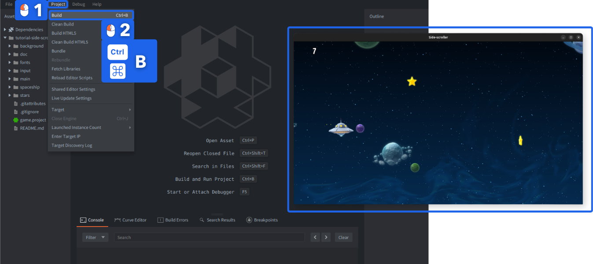

Try steering the space ship with the Up <kbd>↑</kbd> and Down <kbd>↓</kbd> arrow keys and pick up stars for points.

## Tweaking the game

The game isn’t very fun yet, but you can easily improve it with a few simple tweaks. You’ll be making these updates live, so make sure you keep the game running somewhere on your desktop.

### Open the spaceship script

First, let’s adjust the speed of the space ship:

1. Find the file [spaceship.script](defold://open?path=/spaceship/spaceship.script):
2. You can do so with the menu item <kbd>File</kbd> ▸ <kbd>Open Asset...</kbd> or shortcut <kbd>Ctrl</kbd>+<kbd>P</kbd> (<kbd>Cmd</kbd>+<kbd>P</kbd> on Mac).
3. You can start typing the word "spaceship" to search among all the available assets.
4. Select the file "spaceship.script".
5. Click the button <kbd>Open</kbd> to open the file in the Lua code editor.

   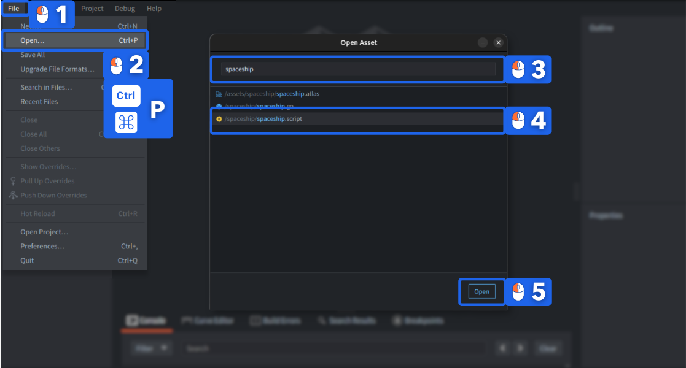

### Code Editor

The script will be opened in a built-in Defold code editor:

   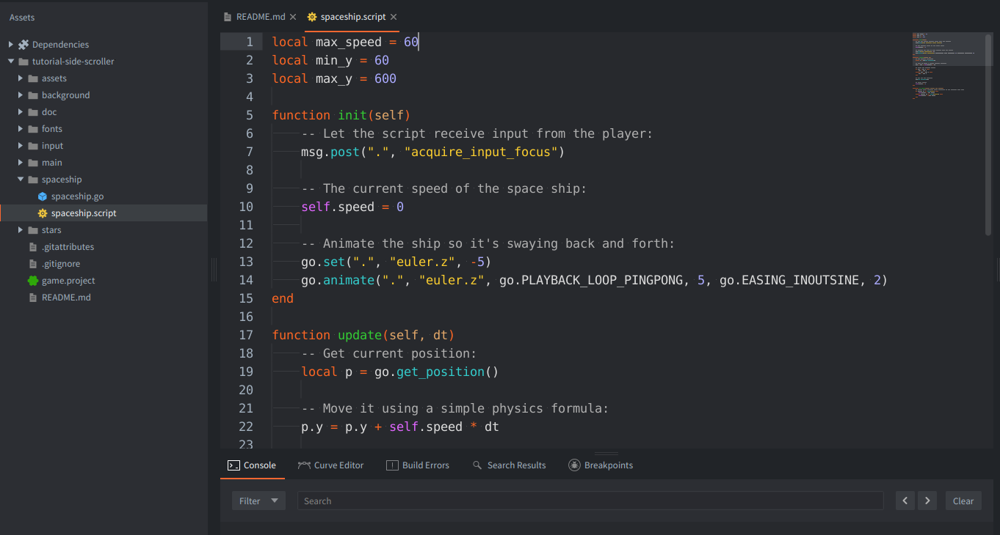

### Editing side-by-side

It might be convenient for this tutorial to split the Code Editor into two panes, so that you can see `README.md` and the currenly edited file simultaneously.

1. <kbd>Right click</kbd> on the file tab.
2. Select <kbd>Move to Other Tab Pane</kbd>.

   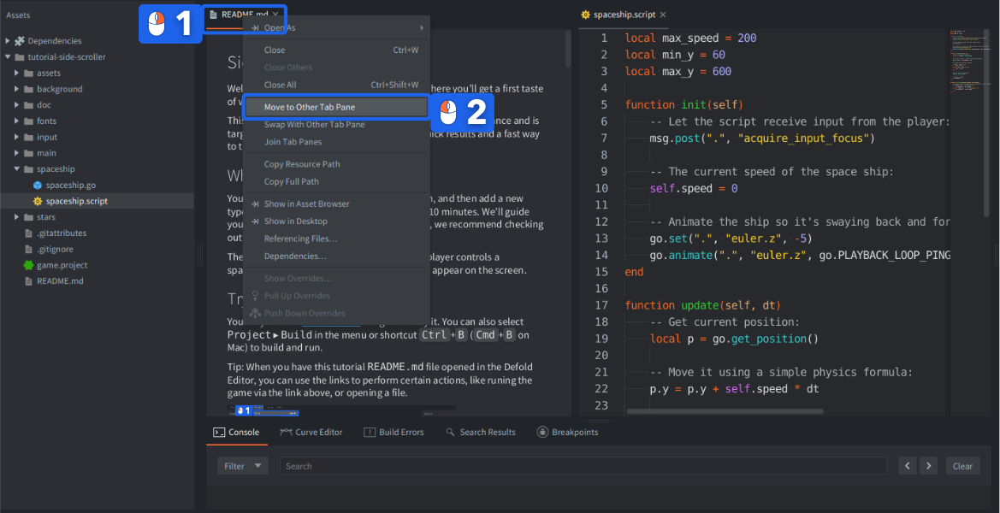

### Make the spaceship go faster

1. At the top of the file, change the line:

   ```lua
   local max_speed = 60
   ```

   to:

   ```lua
   local max_speed = 200
   ```

   This will increase the movement speed of the space ship.

2. If you didn't close the game, you can reload the script file into the running game with <kbd>File</kbd> ▸ <kbd>Hot Reload</kbd>` or shortcut <kbd>Ctrl</kbd>+<kbd>R</kbd> (<kbd>Cmd</kbd>+<kbd>R</kbd> on Mac). You should see in the console:

      ```INFO:RESOURCE: /spaceship/spaceship.scriptc was successfully reloaded.```

   And game should be still running. Otherwise, build and run it again.

Try moving the space ship with the arrow-keys on your keyboard. Notice how it moves faster now.

### More points for a star

Currently, the player only gets 1 point for each star collected. A higher score is more fun, so let’s fix that.

1. Open the file ["star.script"](defold://open?path=/stars/star.script). Either click the link here, use <kbd>File</kbd> ▸ <kbd>Open Asset...</kbd>, or find the file in the *Assets* browser in the leftmost editor pane and double click it. The file is in the folder named `stars`.

2. At the top of the file, change:

   ```lua
   local score = 1
   ```

   to:

   ```lua
   local score = 1000
   ```

3. Reload the script file into the running game with <kbd>File</kbd> ▸ <kbd>Hot Reload</kbd>.

Try to collect some stars and notice how the score has increased.

## Adding bonus stars

The game would be more interesting if bonus stars appeared every now and then. To make that happen, you need to create a new *game object file* that will serve as a blueprint/prefab/prototype for the new type of star.

1. <kbd>Right click</kbd> the "stars" folder in the *Assets* view and select <kbd>New...</kbd> ▸ <kbd>Game Object</kbd>.
2. Name the new file "bonus_star". (The editor will automaticaly append a file type suffix so the full name will be "bonus_star.go".)

   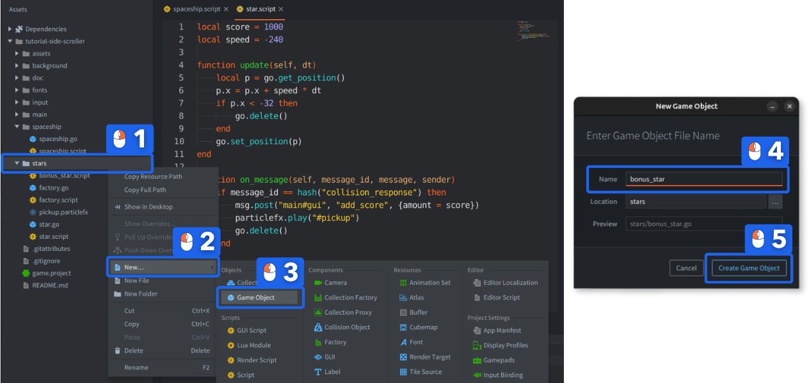

2. The editor automatically opens the new file so you can edit it.

3. Add a *Sprite* component to the game object. Right-click the root of the *Outline* view and select <kbd>Add Component</kbd> ▸ <kbd>Sprite</kbd>. This allows you to attach graphics to the bonus star.

   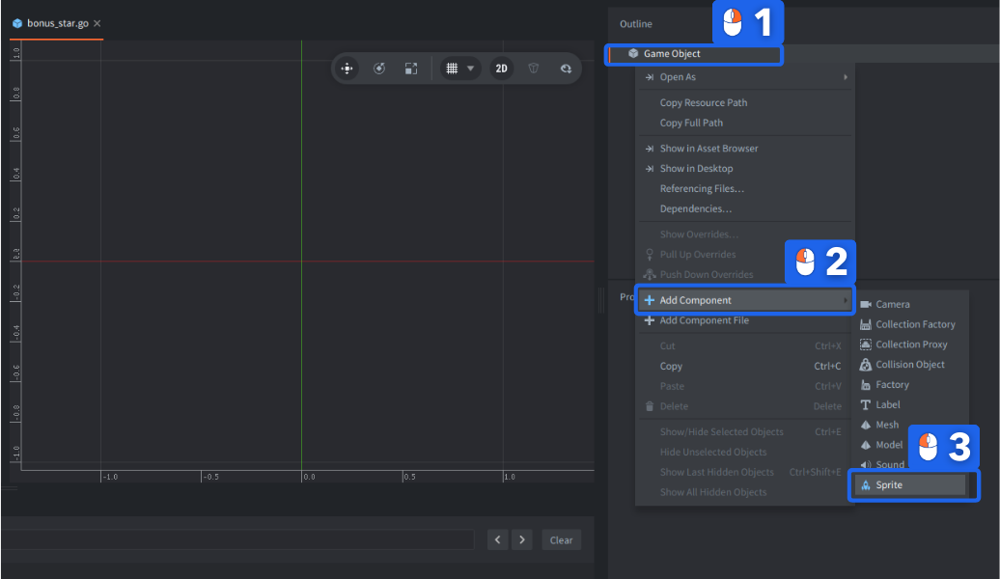

### Adding bonus star visuals

In the *Outline* view on the right side, you will see a new item called "sprite". When it is clicked, its properties are displayed in the *Properties* view below. The sprite currently has no graphics attached so you need to do that:

1. Set the *Image* property to "stars.atlas" by using the browse-button (<kbd>...</kbd>). The atlas contains the graphics for the bonus star.

2. Set *Default Animation* to "bonus_star" - it is a name of an animation defined in the atlas.

3. A green star should now appear in the editor. Hit the <kbd>F</kbd> key or select <kbd>View</kbd> ▸ <kbd>Frame Selection</kbd> if the view of the star is not very good.

   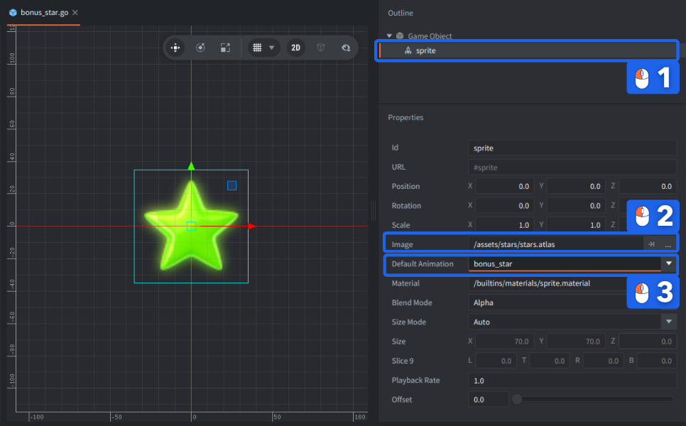

### Adding collision object

We need to detect a collision between the ship and the bonus star. In Defold, we use a component called *Collision Object*, which is already used by the spaceship to collide with regular stars and collect them. We will now add a *Collision Object* to the bonus star as well.

1. <kbd>Right click</kbd> the root "Game Object" item in the *Outline* view.
2. Select <kbd>Add Component</kbd> ▸ <kbd>Collision Object</kbd>.

   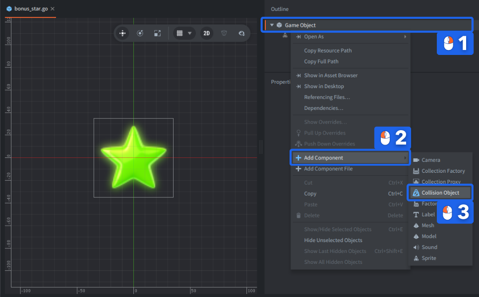

### Defining collisions

We'll define the type of the collision object and add a basic shape:

1. Click on the "collisionobject" item in the *Outline* view to show its properties.

2. In the *Properties* view, set the *Type* property to **"Kinematic"** (or "Trigger", in our case it doesn't matter much, as we only need to detect overlapping). This means that the collision object will follow the game object it belongs to.

3. <kbd>Right click</kbd> the "collisionobject" in the *Outline* view and select <kbd>Add Shape ▸ Sphere</kbd>. Any shape(s) you add to the collision object defines its boundary as far as collisions are concerned.

   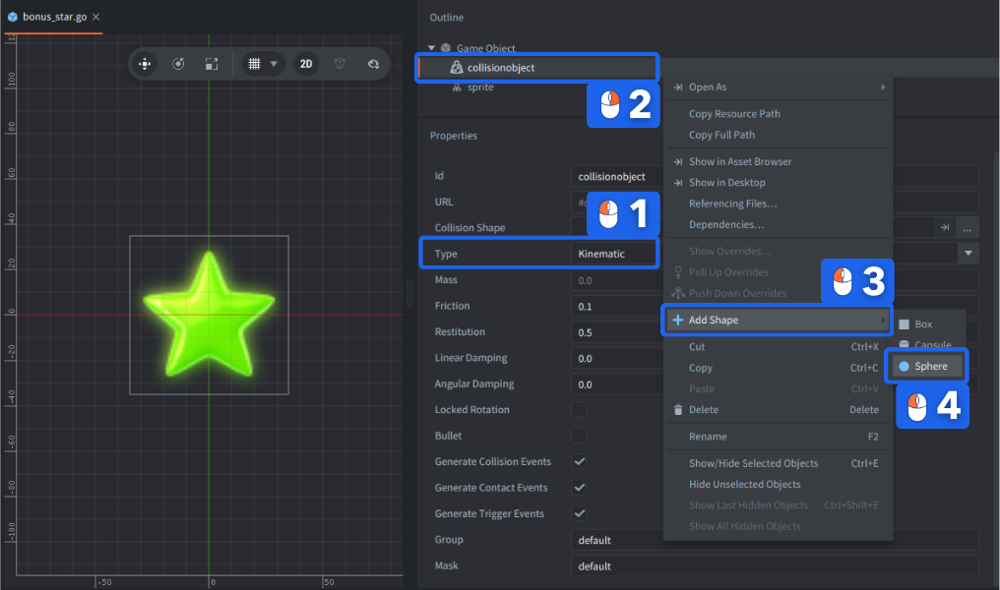

### Adjusting the shape

1. Select the *Scale Tool* in the toolbar (shortcut <kbd>R</kbd>) and use the scale handle (2) to resize the sphere in the scene view until it reasonably covers the star. You can also edit the *Diameter* property directly in the *Properties* view.

   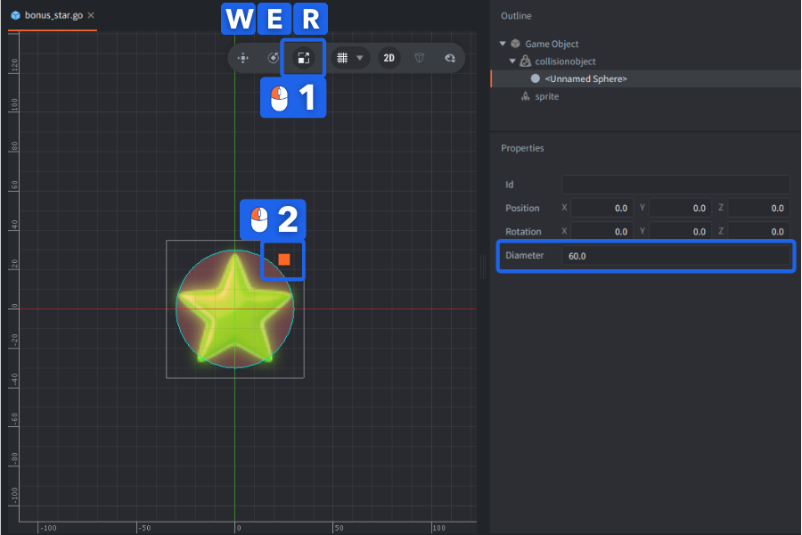

### Adding bonus star script

1. <kbd>Right click</kbd> the root "Game Object" item in the *Outline* view again and select <kbd>Add Component File</kbd>, then select the script file "bonus_star.script". This script moves the bonus stars and make sure the player gets the right amount of points for catching them.

   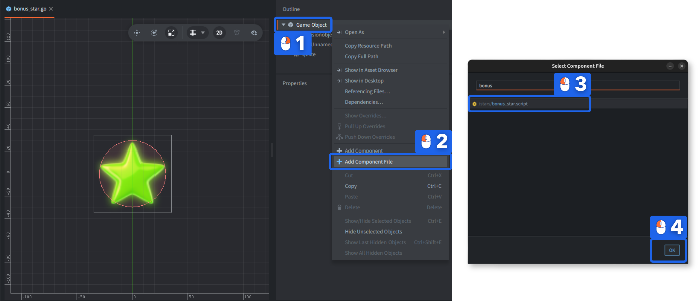

The bonus star game object file that you have now created contains the blueprint for a game object containing graphics (the sprite), collision shapes (the collision object) and logic that moves the star and reacts to collisions (the script).

### Creating the bonus star factory

*Factory Components* are responsible for making sure game objects of various kind appear in the game. For your new bonus stars, you need to create a factory:

1. Open the file "factory.go" with <kbd>File ▸ Open Assets...</kbd>. This game object file contains a script and a factory.

2. Add a secondary factory component to it. Right click the root "Game Object" item in the *Outline* view and select <kbd>Add Component</kbd> ▸ <kbd>Factory</kbd>.

   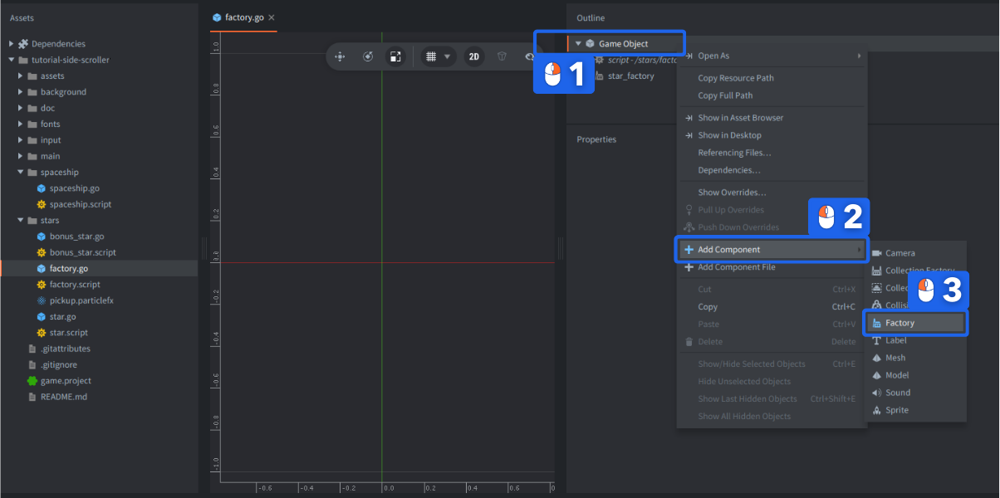

### Setting prototype of the factory

1. Set the new factory component's *Id* property to **"bonus_factory"**.

2. Set its *Prototype* property to "bonus_star.go" with the browse-button (<kbd>...</kbd>).

   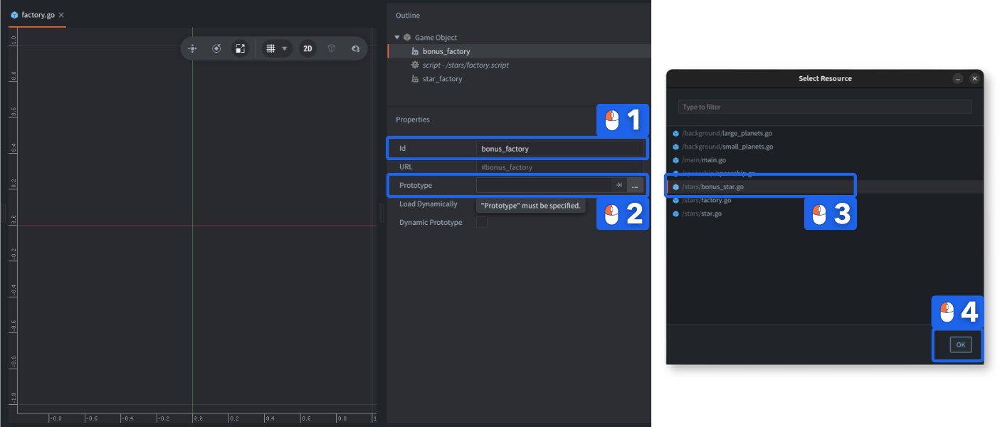

### Modify the factory script

The last step is to make sure the factory game object starts creating the bonus stars by modifying its script.

1. Open [factory.script](defold://open?path=/stars/factory.script) with <kbd>File</kbd> ▸ <kbd>Open Assets...</kbd> or from the *Assets*.

2. Near the bottom of the file, uncomment the line:

   ```lua
   -- component = "#bonus_factory"
   ```

   to:

   ```lua
   component = "#bonus_factory"
   ```

   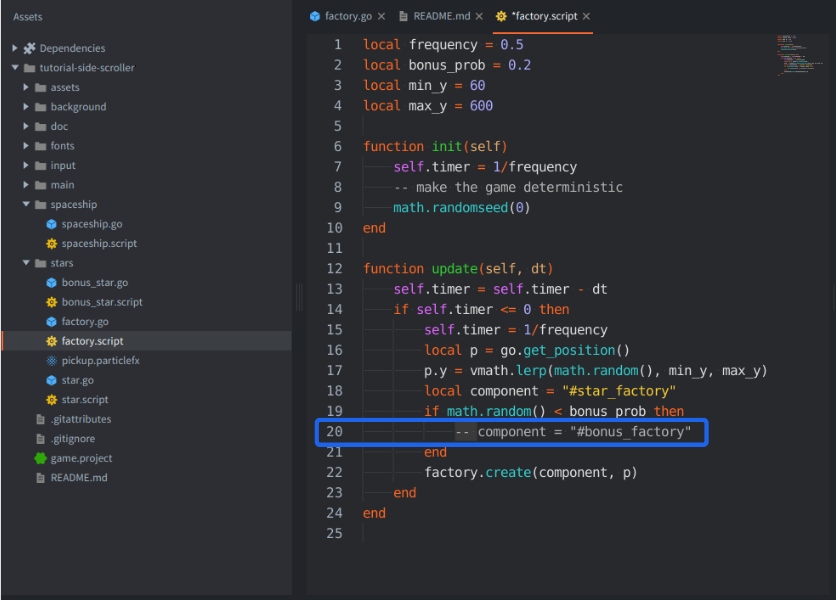

   This causes the bonus stars to appear roughly 20% of the time.

### Restart the game

1. Save everything and restart the game by closing the window (or press <kbd>Escape</kbd> – assuming you didn't disabled the "Escape Quits Game" option in <kbd>File</kbd> ▸ <kbd>Preferences</kbd>), then select <kbd>Project</kbd> ▸ <kbd>Build</kbd> from the editor menu or shortcut <kbd>Ctrl</kbd>+<kbd>B</kbd> (<kbd>Cmd</kbd>+<kbd>B</kbd> on Mac).

   The new bonus stars will start to appear!

   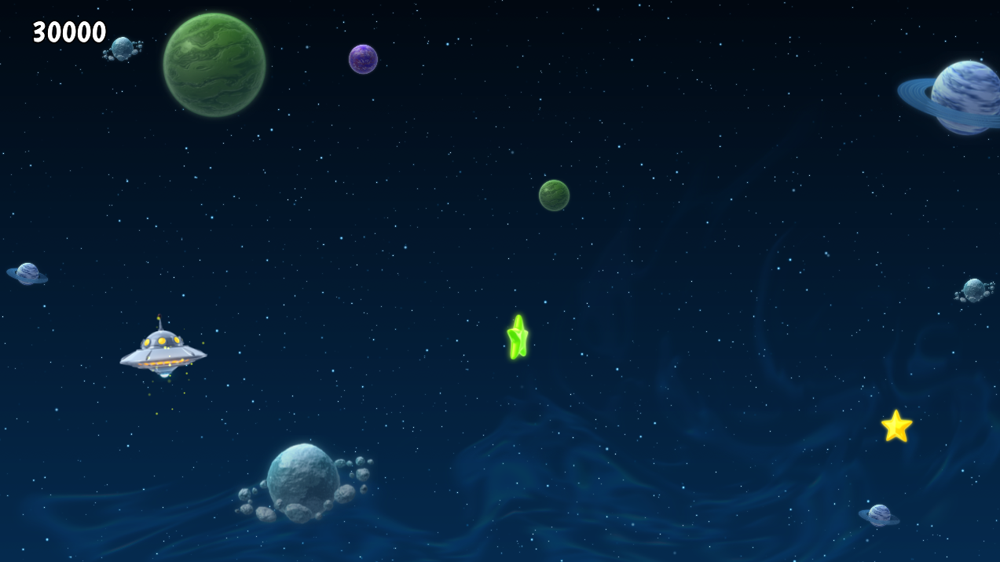

*You Win!*

Now go ahead and create more games in Defold!

Check out [the documentation pages](https://defold.com/learn) for examples, tutorials, manuals and API docs.

If you run into trouble, help is available in [our forum](https://forum.defold.com).

Happy Defolding!

----
